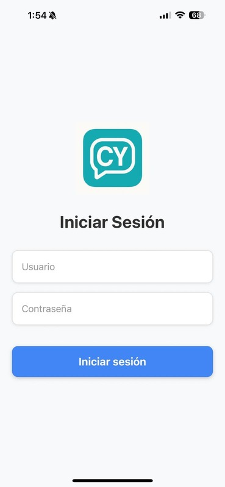
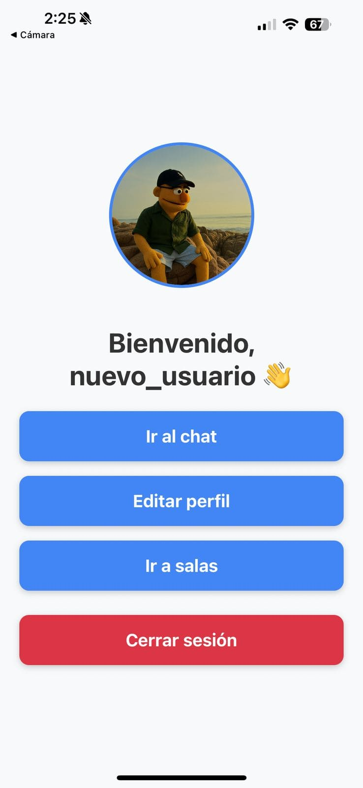
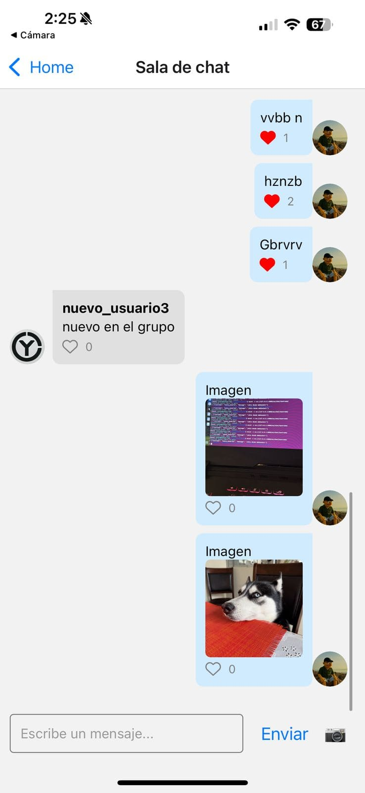

# 🗨️ Cytalk - Real-Time Chat App


Cytalk es una aplicación de chat en tiempo real desarrollada con **Django**, **Django Channels**, **React Native (Expo)** y **Firebase**. Soporta mensajería instantánea, reacciones, subida de imágenes, notificaciones push y autenticación JWT. ¡Todo desde cero! 🚀

## 🌐 Demo local

| Backend | Frontend |
|--------|----------|
| `http://127.0.0.1:8000/swagger/` | App Expo (localhost/IP en `ALLOWED_HOSTS`) |

---

## 🔧 Tecnologías

### Backend
- 🐍 Python 3.12
- 🧠 Django + DRF
- 🔌 Django Channels (WebSockets)
- 🛢️ PostgreSQL
- 🔐 JWT (SimpleJWT)
- ☁️ Firebase Admin SDK (FCM)
- 📘 Swagger (`drf-yasg`)

### Frontend (Expo)
- ⚛️ React Native
- 🧰 Redux Toolkit
- 🧠 AsyncStorage
- 📸 Expo Image Picker
- 🔔 expo-notifications + FCM

---

## ✅ Funcionalidades

- ✅ Registro e inicio de sesión con imagen de perfil
- ✅ Persistencia de sesión
- ✅ Crear y entrar a salas dinámicamente
- ✅ Envío de mensajes en tiempo real vía WebSocket
- ✅ Subida de imágenes como mensajes
- ✅ Reacciones (likes)
- ✅ Notificaciones push cuando se recibe un mensaje
- ✅ Documentación Swagger disponible
- ✅ Modal de vista completa para imágenes

---

## 📸 Capturas (opcional)

Puedes agregar capturas como:

### Login

### Home

### Chat

### Image

### Rooms


---

## 🚀 Cómo correrlo

### 🐍 Backend

```bash
cd backend
python -m venv env
source env/bin/activate
pip install -r requirements.txt
python manage.py migrate
python manage.py runserver
```

### 📱 Frontend (Expo)

```bash
cd frontend
npm install
npx expo start
```

---

## 👨‍💻 Autor

**Christian Ytuza**  
💻 Fullstack Mobile & Web Developer  
🌎 [cytuza.com](https://cytuza.com)